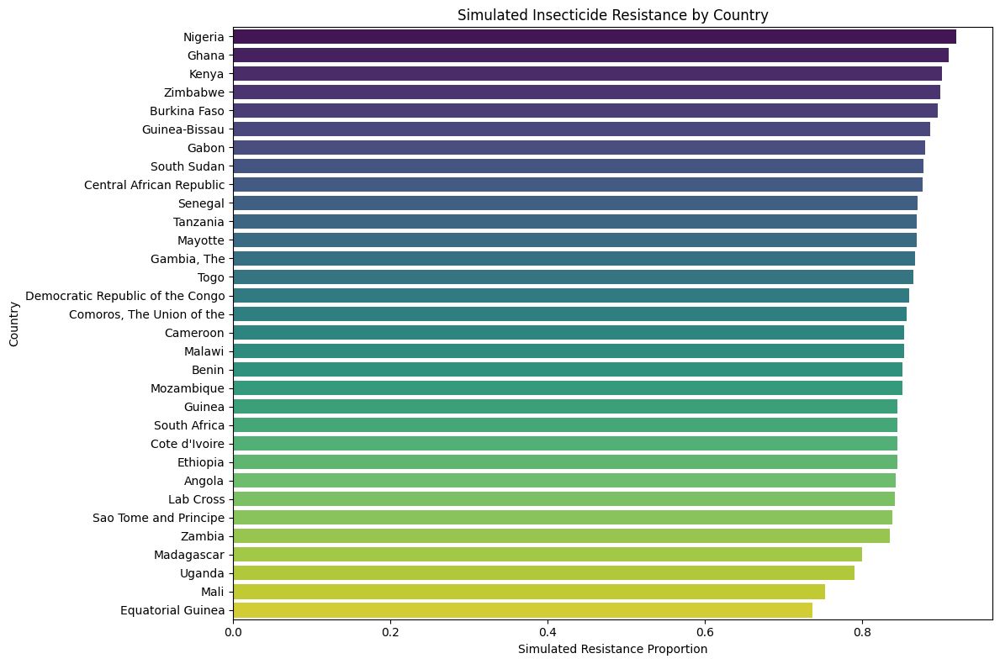
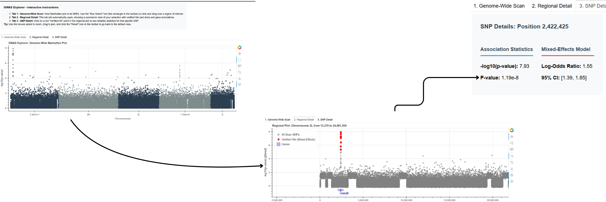
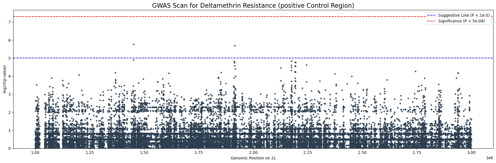
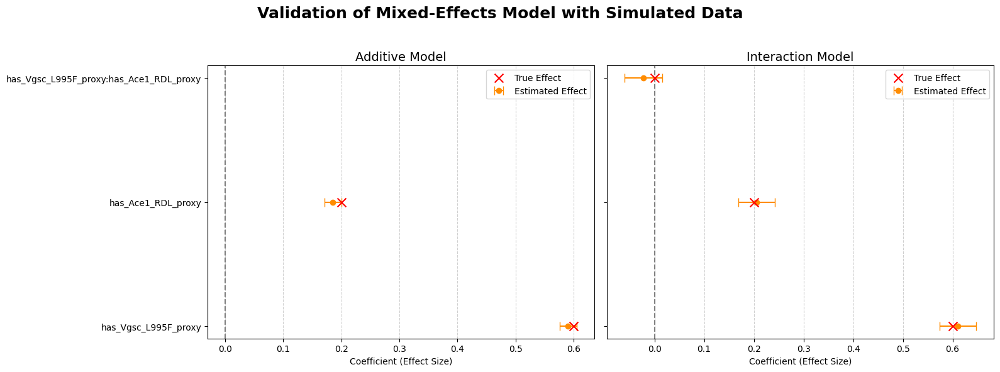

# Google Summer of Code 2025 Final Report: Cloud-Native Tools for Detecting Novel Insecticide Resistance in Malaria Mosquitoes

- **Contributor:** Mohamed Laarej
- **Organisation:** MalariaGEN
- **Mentors:** Anastasia Hernandez-Koutoucheva, Chris Clarkson, Jon Brenas
- **Project Repository:** https://github.com/malariagen/vector_gwas_exploration 
- **Contact:** `mohamed.laarej.eng@gmail.com` / [GitHub Profile](https://github.com/mohamed-laarej)

---

### Abstract

Accurate detection of insecticide resistance in *Anopheles* mosquitoes is critical for effective malaria control, yet current analytical methods are often confounded by complex population structures. This project addressed this challenge by developing a robust, cloud-native toolkit for Genome-Wide Association Studies (GWAS). The core of the project was a two-phase pipeline: a highly sensitive initial scan to identify candidate regions, followed by a rigorous verification step using advanced statistical models - including Mixed-Effects and Bayesian approaches - to eliminate false positives. A key finding was that spurious signals from population structure can be stronger than true biological signals, validating the necessity of this two-step design. The final deliverable is a suite of validated Python tools, analysis notebooks, and an interactive dashboard prototype that provide a clear, statistically sound workflow for identifying novel resistance markers from complex genomic data.

---

### 1. Motivation & Overview

Recent progress in the fight against malaria has been hindered by the rise of insecticide resistance in mosquitoes. Resistance can manifest and evolve in different ways across diverse mosquito populations, and the misidentification of the resistance mechanisms present in a specific population can lead to wasted public health efforts. This project tackled this issue by building a computational toolkit designed to correctly identify the complex signals of insecticide resistance. My goal was to create a workflow that could first cast a wide net to find all potential resistance signals and then, most importantly, use more sophisticated statistical methods to filter out the false alarms caused by population structure. This work matters because reliable genetic surveillance is the foundation of any effective, long-term strategy to manage insecticide resistance and control malaria.

---

### 2. Technical Contributions

My work on this project was a journey of building, testing, and refining a complete analytical pipeline. Each component I developed was a response to the challenges presented by the massive, complex genomic data, leading to a much deeper understanding of the problem.

#### 1. Data Foundation: Phenotype Loading & Simulation

-   **What I built:** The first critical step was contributing functions directly to the `malariagen_data` API to load real-world phenotype data from the cloud. To supplement this, I built a `ResistanceSimulator` that generates realistic phenotype data based on known genetic markers.
-   **Why it matters:** Real labeled data was sparse. The simulator became the bedrock of the entire project, allowing me to create a "ground truth" dataset. It was essential for rigorously testing and debugging all the statistical models before using them on real, messy data.
-   **How it works:** The simulator uses a probabilistic approach, calculating a mosquito's resistance based on the presence of key variants (like *Vgsc*) and adding realistic confounding noise based on the sample's country of origin.
-   **Personal note:** My first merged PR to the main API was a huge moment for me. Building the simulator felt like designing my own experiment; it gave me the confidence to challenge the models and trust my results when they produced something unexpected.


**Figure 1:** A bar plot showing the different mean resistance rates per country in the simulated dataset. This highlights the strong, built-in confounding effect of population structure that the statistical models must account for.


#### 2. The Model Suite: From Baseline to Bayesian

-   **What I built:** A suite of three model classes with a consistent, interchangeable interface (`.fit()`, `.get_params()`): `LogisticRegressionGWAS`, `MixedEffectsGWAS`, and a flexible `BayesianModel` using PyMC.
-   **Why it matters:** This provides a "panel" of statistical tools for the verification step. The simple Logistic Regression helped establish a baseline, while the Mixed-Effects and Bayesian models were essential for tackling the complex statistical challenges like population structure, which later proved to be critical.
-   **How it works:** Each class is a wrapper for a major statistical library (`statsmodels` for regression models and `PyMC` for the Bayesian approach). I designed them to be plug-and-play components for the verification pipeline, all capable of testing for gene-gene interaction effects. 
-   **Personal note:** The journey from implementing the simple logistic model to debugging the PyMC sampler for the Bayesian model was a massive learning curve. Stabilizing the model against numerical errors and seeing it run efficiently was a difficult but incredibly rewarding challenge.

#### 3. The Two-Phase GWAS Pipeline: A Necessary Design

-   **What I built:** A two-step GWAS pipeline consisting of a `GWASScanner` for rapid, sensitive discovery and a `GWASVerifier` for specific, rigorous follow-up.
-   **Why it matters:** My analysis proved that this two-phase design is not just a good idea—it's **essential** for this dataset. The scanner is a sensitive tool to find *every possible* signal, and the verification step, using the advanced models, is the critical filter to determine which of those signals are *real*.
-   **How it works:**
    -   The **Scanner** (`scanner.py`) iterates through the genome, using a Chi-squared test to flag any SNP with a potential association. I spent significant time optimizing this script to make a full genome scan feasible.
    -   The **Verifier** (`verifier.py`) is a model-agnostic framework that takes the top hits from the scanner and re-analyzes them with the more computationally expensive but statistically robust models.
-   **Personal note:** The moment I realized *why* the scanner was finding false positives was the biggest turning point. It shifted my perspective from just "building a tool" to understanding the deep statistical story the data was telling.

#### 4. Interactive Visualization Dashboard: From Data to Discovery

-   **What I built:** A functional, three-panel interactive dashboard prototype (`build_explorer.py`) using `Bokeh`, based directly on my project proposal.
-   **Why it matters:** Static Manhattan plots are not enough to explore complex results. This tool directly addresses the project's goal of creating an intuitive way for researchers to explore the data, from a genome-wide overview down to a single SNP's model comparison.
-   **How it works:** It's a standalone HTML file that uses `CustomJS` callbacks in Bokeh to link a genome-wide Manhattan plot, a regional "zoom-in" plot, and a final SNP detail panel. This allows users to explore the results without needing a Python environment.
-   **Personal note:** Seeing the dashboard come to life was incredibly rewarding. Taking the project from raw data and statistical models to a polished, interactive user interface felt like I was building a complete, professional tool from start to finish.


**Figure 4:** The complete interactive workflow of the GWAS Explorer dashboard. A user can (1) select a region of interest on the genome-wide Manhattan plot, which automatically updates (2) the regional plot with verified hits and gene annotations, and then (3) click a specific hit to view a detailed statistical summary.

---

### 3. Milestones & Methods

| Milestone                      | Short description                                                              | Status      | Link (PR / notebook / script)                                                                                                                              |
| :----------------------------- | :----------------------------------------------------------------------------- | :---------- | :-------------------------------------------------------------------------------------------------------------------------------------- |
| **Phenotype Data Loading**     | Contributed functions to the main `malariagen_data` API for cloud data access. | **Merged**  | [The phenotypes functions PR](https://github.com/malariagen/malariagen-data-python/pull/792) |
| **Data Simulation Framework**  | Built the `ResistanceSimulator` to create validation datasets with confounding.| **Merged**  | [`src/data/simulation.py`](https://github.com/malariagen/vector_gwas_exploration/tree/master/src/data/simulation.py) |
| **Initial Model Suite**        | Implemented `LogisticRegression` and `MixedEffects` models.                    | **Merged**  | [`src/models/mixed_effects.py`](https://github.com/malariagen/vector_gwas_exploration/tree/master/src/models/mixed_effects.py) |
| **Bayesian Model**             | Implemented a robust and flexible `BayesianModel` class with PyMC.             | **Merged**  | [Bayesian Model PR](https://github.com/malariagen/vector_gwas_exploration/pull/10) |
| **GWAS Scanner & Validation**  | Optimized the scanner and performed positive/negative control tests.           | **Open PR** | [GWAS Scanner PR](https://github.com/malariagen/vector_gwas_exploration/pull/4) |
| **CI/CD & Code Quality**       | Set up and fixed CI checks for code quality using `black` and `ruff`.            | **Merged**  | [CI/CD PR](https://github.com/malariagen/vector_gwas_exploration/pull/8) |
| **Interactive Visualization**  | Built the final dashboard prototype and integrated it with mock data.          | **Open PR** | [Visualization PR](https://github.com/malariagen/vector_gwas_exploration/pull/12) |

### 4. Results & Key Findings

-   **Population Structure is the Dominant Signal:** My most critical finding is that confounding from population structure is a major factor in this dataset. The uncorrected Chi-squared scan produced a false-positive signal in our negative control region (`-log10(p) = 6.6`) that was **stronger than the true signal** from the known resistance gene *Vgsc* (`-log10(p) = 5.8`).

  
**Figure 2:** The result of the `GWASScanner` on the positive control region on chromosome 2L. The scan correctly identifies a strong, statistically significant peak of association (`-log10(p) ≈ 5.8`) that aligns with the location of the *Vgsc* gene, validating the pipeline's sensitivity to detect major resistance loci.


-   **The "Deceptive" Interaction:** The baseline `LogisticRegressionGWAS` model initially appeared to find a strong, significant interaction effect between genes. However, the more robust `MixedEffectsGWAS` model correctly concluded this was a spurious finding, demonstrating that the simpler model was being "tricked" by the un-modeled country-level effects.

  
**Figure 3:** Validation of the `MixedEffectsGWAS` model on the simulated data. The model accurately estimates the true effect sizes for both the additive (left) and interaction (right) models. Crucially, it correctly finds that the interaction term is not statistically significant, demonstrating its ability to control for the confounding effects that misled simpler models.


-   **Key Questions Raised by the Initial Scan**

The strength of the false-positive signal in our negative control test prompts three important considerations for future work:

1. **It confirms the necessity of our two-phase approach.**  
   A simple scan is clearly insufficient, and a rigorous verification step with models like *MixedEffectsGWAS* is essential to filter out these strong, spurious signals.

2. **It questions the trustworthiness of the scanner.**  
   While sensitive, the Chi-squared test might be generating too much noise. Future work could explore whether a more sophisticated method for the initial scan (like a linear mixed model) might provide a cleaner set of initial candidates for Phase 2.

3. **It challenges our assumptions.**  
   There is a small but real possibility that the "gene desert" region is not a true negative control and that we have uncovered a novel biological signal. This surprising result warrants further investigation.


### Key Takeaway
A simple GWAS scan on complex data can raise more questions than it answers, highlighting the **absolute necessity of a multi-layered, statistically robust verification strategy**.


---

## 5. Reflections & What I Learned

This GSoC project was far more than a coding task; it was a profound learning experience that reshaped how I approach complex problems.  

**Technically**, I went on a deep dive into performance optimization and debugging, learning the hard way that a fast but incorrect solution is useless. The journey to a robust GWASScanner taught me the immense value of rigorous validation at every step.  

However, the most important lessons were not in the code itself. Working with my mentors, I learned the incredible power of asking the right questions. There were moments I felt stuck, staring at confusing results. In our meetings, a simple, insightful question from a mentor would often reframe the entire problem, making the path forward clear. It taught me that clarity of thought is the most effective debugging tool.  

This experience also underscored the importance of **communicating your thought process**. Sharing not just my successes, but also my confusing results, failed attempts, and half-formed ideas was crucial. It was in those moments of open discussion that the best solutions emerged.  

I saw firsthand how a simple piece of code, when validated and explained clearly, can have a huge impact by revealing a complex scientific story — like the confounding effects in our data. This project has fundamentally shifted my perspective: I now see that being open to other ideas and perspectives isn't just helpful — it’s the only way to truly improve the work you are doing.  

---

## 6. Future Work

This project has successfully built and validated the core components of the GWAS pipeline.  
The following are **concrete and prioritized next steps** to transition this toolkit from a successful prototype into a fully-fledged discovery tool for malaria researchers.

---

### 1. Run Full Genome-Wide Scan & Verify Top Hits (High Priority)

- **Why it matters**:  
  This is the key data generation step that will transform the dashboard from a demonstration into a real discovery tool, allowing researchers to interactively explore a complete, verified map of resistance signals across the entire genome.

- **Task**:  
  Use the validated `GWASScanner` and `GWASVerifier` to produce the final dataset.

- **Complexity**:  
  Low (computationally intensive, but the code is ready).

---

### 2. Implement a Robust Testing Suite (High Priority)

- **Why it matters**:  
  Scientific results must be trustworthy. A formal testing suite with `pytest` ensures that any future updates won't accidentally break the core statistical logic, giving researchers long-term confidence in the tool's reliability.

- **Task**:  
  Write unit tests for key functions in the models and scanner, and integrate them with the CI pipeline.

- **Complexity**:  
  Medium.

---

### 3. Implement Hierarchical Bayesian Model (Medium Priority)

- **Why it matters**:  
  Analysis proved controlling for population structure is critical. A **Hierarchical Bayesian Model** would provide researchers with a powerful probabilistic measure of confidence for each hit, allowing them to see not just if a SNP is significant, but how likely it is to be a true driver of resistance.

- **Task**:  
  Create a new `HierarchicalBayesianModel` class that incorporates country-level effects, building on the existing `BayesianModel`.

- **Complexity**:  
  Medium.

---

### 4. Integrate Real Data into Dashboard (Medium Priority)

- **Why it matters**:  
  This is the final step to complete the visualization, moving the dashboard from a prototype to a fully functional tool that researchers can use for their own analyses.

- **Task**:  
  Update the dashboard's data loading scripts to use the output from the full genome scan.  
  *(This is dependent on the completion of the scan.)*

- **Complexity**:  
  Low to Medium.
---


## 7. Suggestions for Future GSoC Contributors

Based on my experience this summer, I would offer the following advice to future GSoC contributors working with **MalariaGEN** or on similar large-scale bioinformatics projects:

### 1. Focus Fully on the Project
If it is possible for you, I highly recommend dedicating your summer solely to GSoC.
I found that the project requires significant focus, not just to write the code, but to think deeply about the results and explore creative solutions. 
Avoiding distractions from other internships or projects will allow you to immerse yourself in the work and deliver a final product of much higher quality. 
The experience is rewarding enough to be your primary commitment.

### 2. Listen to the Questions
Working with the MalariaGEN team will be one of the best experiences you'll have.  
My advice is to not just answer your mentors' questions, but to **truly listen** to them.  
The questions my mentors asked were never just simple queries; they were insightful prompts that guided me toward the deeper challenges and most important discoveries in my project.  
Analyzing *why* they are asking a certain question can be a complete game-changer and can help you focus on what really matters.

### 3. Communicate Your Thought Process, Not Just Your Code
Regular, transparent communication is crucial.  
Don’t wait until your code is perfect to share it. Share your **messy notebooks, confusing results, and half-formed ideas**.  
Explaining your thought process is how you get the best feedback and how you build a real collaborative relationship with your mentors.

### 4. Don’t Settle for the Minimum; Be Creative
The project proposal is a starting point, not a restrictive checklist.  
The most rewarding parts of my GSoC experience came when I pushed beyond the basic requirements.  

For example, building the interactive dashboard wasn’t just about finishing a task — it was a chance to be creative and think deeply about how to make the results accessible and useful for researchers.  
Always look for opportunities to **add your own creative touch** — it’s what makes the project truly yours and much more impactful.

### 5. When Stuck, Zoom Out
There were several times I felt completely stuck on a technical bug or a confusing result.  
The best strategy I found was to take a step back from the code and rethink the **end goal**.  

I would ask myself:  
*“What is the final vision for this tool? How do I want it to work, and what story should it tell?”*  

Reconnecting with that high-level vision always helped me clear my mind and build a new, better roadmap to get there.  
It’s a powerful way to turn frustration into a fresh start.

---


### 8. How to Reproduce / Where to Find the Code

All code, models, and notebooks are publicly available in the project repository.

-   **Repository URL:** [Project GitHub Repo](https://github.com/malariagen/vector_gwas_exploration)
-   **Key Scripts:**
    -   GWAS Scanner: `src/analysis/gwas/scanner.py`
    -   Verification Models: `src/models/`
    -   Dashboard Builder: `src/visualization/build_explorer.py`
-   **Key Notebooks:**
    -   GWAS Positive Control Test: `notebooks/04_gwas_scan.ipynb`
    -   GWAS Negative Control Test: `notebooks/08_gwas_scan_negative_control.ipynb`
    -   Bayesian Model Validation: `notebooks/06_bayesian_model_simulation.ipynb`

### Minimal Example: Reproducing the Dashboard Prototype

The best way to see the project's output is to generate the interactive dashboard using the mock data.

**Step 1: Set up the environment and install dependencies**
This project uses Poetry for dependency management.

```bash
# Clone the repository
git clone https://github.com/malariagen/vector_gwas_exploration.git
cd vector_gwas_exploration

# Install dependencies using Poetry
poetry install
```

**Step 2: Generate the mock data**
The easiest way to generate the required data is by running the dedicated Jupyter notebook.

```bash
# Activate the environment managed by Poetry
poetry shell

# Start Jupyter and run the data generation notebook
jupyter notebook
```
Inside Jupyter, open and run the notebook: `notebooks/00_generate_mock_data.ipynb`. This will create the necessary CSV files in the `/data` directory.


**Step 3: Build the standalone HTML dashboard**
Once the mock data is generated, run the build script from your terminal (while still in the poetry shell).
```bash
# From the project's root directory
python src/viz/build_explorer.py
```

**Step 4: View the result**
The script will generate a single, self-contained HTML file. Open it in your web browser to explore the interactive dashboard.
* File Location: `output/gwas_explorer.html`

---

### 9. Acknowledgements

My Google Summer of Code experience would not have been possible, nor as rewarding, without the incredible support and guidance of my mentors and the wider MalariaGEN community.

I would like to extend my deepest gratitude to my mentors: **Anastasia Hernandez-Koutoucheva, Chris Clarkson, and Jon Brenas**. From the very first day, they placed their trust in me and dedicated a significant amount of their time and effort to guiding this project. What I appreciated most was their approach to mentorship. They were not just professional and kind, but they created an environment where I felt genuinely heard. They welcomed every idea, no matter how half-formed, and took my thoughts and contributions seriously, which was incredibly empowering. It was their insightful questions that truly shaped my experience, teaching me how to think more critically and see the deeper story within the data.

I also want to thank the entire MalariaGEN community for providing such a welcoming environment and for stewarding the incredible open-source dataset that made this work possible. This project showed me firsthand how a simple piece of code, when applied to important data, can have a great impact. This experience has been invaluable, and I am truly thankful to everyone who made it possible.
